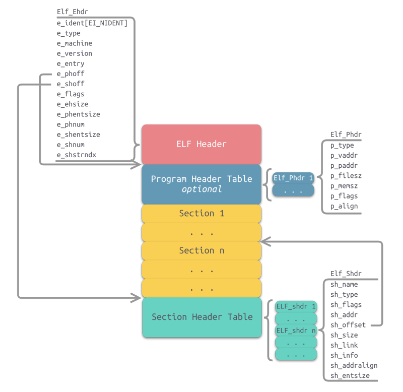
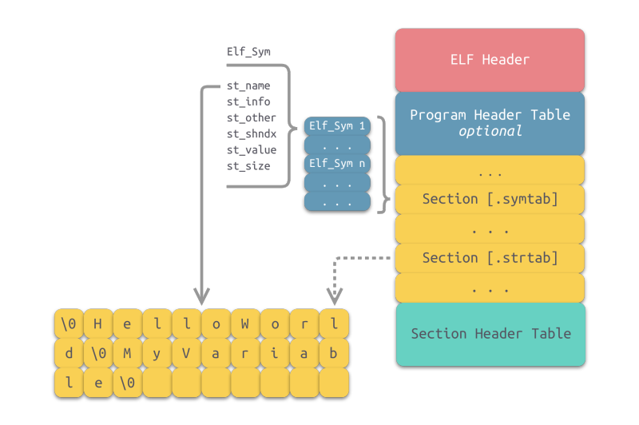

### ELF文件格式解析

代码经过编译器进行编译之后会生成目标代码，而目标代码的存放则是放在了所生成的目标文件。目标文件中的内容至少有编译后的机器指令代码、数据。除此之外，还需要编译链接时的一些额外信息，比如符号表、调试信息、符串等。一般目标文件将这些信息按不同的属性，以“节”(Section)的形式存储，在一般情况下，它们都表示一个一定长度的区域。当多个目标文件链接成一个可执行文件时，会将相同权限的节合并到一个段(Segment)中。  
不同的操作系统又具有不同格式的目标文件，在Windows下为PE文件，Linux下为  
由于本综设项目是进行Linux ARM下的编译链接并生成可执行文件，所以可执行文件的格式为ELF文件，下文则介绍ELF文件的具体格式以及查看ELF文件的方法。

**1. ELF文件结构概览**

<center>

</img>
图1.ELF文件格式
</center>

如图所示，为ELF文件的基本结构，其主要由四部分组成：  
ELF Header  
ELF Program Header Table (或称Program Headers、程序头)  
ELF Section Header Table (或称Section Headers、节头表)  
ELF Sections  
从图中，我们就能看出它们各自的数据结构以及相互之间的索引关系。  

由于程序中段和节的数量不固定，程序头表和节头表的大小也就不固定。并且各表在程序中存储的先后顺序不同，所有这些表在程序中存储的位置也是不固定了，为了能方便的找到这些表的位置，获取其信息，需要一个固定的结构来描述他们，记录其存储的位置和大小等信息。具体的ELF Header的结构体定义如以下所示
```c
typedef struct{
    unsigned char e_ident[EI_NIDENT];	/* Magic number and other info */
    Elf32_Half e_type;			/* Object file type */
    Elf32_Half e_machine;		/* Architecture */
    Elf32_Word e_version;		/* Object file version */
    Elf32_Addr e_entry;		/* Entry point virtual address */
    Elf32_Off e_phoff;		/* Program header table file offset */
    Elf32_Off e_shoff;		/* Section header table file offset */
    Elf32_Word e_flags;		/* Processor-specific flags */
    Elf32_Half e_ehsize;		/* ELF header size in bytes */
    Elf32_Half e_phentsize;		/* Program header table entry size */
    Elf32_Half e_phnum;		/* Program header table entry count */
    Elf32_Half e_shentsize;		/* Section header table entry size */
    Elf32_Half e_shnum;		/* Section header table entry count */
    Elf32_Half e_shstrndx;		/* Section header string table index */
}Elf32_Ehdr;
```

ELF节头表是一个节头数组。每一个节头都描述了其所对应的节的信息，如节名、节大小、在文件中的偏移、读写权限等。编译器、链接器、装载器都是通过节头表来定位和访问各个节的属性的。

```c
typedef struct{
    Elf32_Word sh_name;		/* Section name (string tbl index) */
    Elf32_Word sh_type;		/* Section type */
    Elf32_Word sh_flags;		/* Section flags */
    Elf32_Addr sh_addr;		/* Section virtual addr at execution */
    Elf32_Off sh_offset;		/* Section file offset */
    Elf32_Word sh_size;		/* Section size in bytes */
    Elf32_Word sh_link;		/* Link to another section */
    Elf32_Word sh_info;		/* Additional section information */
    Elf32_Word sh_addralign;		/* Section alignment */
    Elf32_Word sh_entsize;		/* Entry size if section holds table */
}Elf32_Shdr;
```

程序头是专门用来描述段信息的，程序头描述的段是磁盘上程序中的一个段，常见的如代码段和数据段，下面是其结构。

```c
typedef struct{
  Elf32_Word	p_type;			/* Segment type */
  Elf32_Off	p_offset;		/* Segment file offset */
  Elf32_Addr	p_vaddr;		/* Segment virtual address */
  Elf32_Addr	p_paddr;		/* Segment physical address */
  Elf32_Word	p_filesz;		/* Segment size in file */
  Elf32_Word	p_memsz;		/* Segment size in memory */
  Elf32_Word	p_flags;		/* Segment flags */
  Elf32_Word	p_align;		/* Segment alignment */
} Elf32_Phdr;
```

在Elf文件中，有多种不同类型的节，一些比较重要的节的作用分别如下：  

**.text节**
.text节是保存了程序代码指令的代码节。一段可执行程序，如果存在Phdr，则.text节就会存在于text段中。由于.text节保存了程序代码，所以节类型为SHT_PROGBITS。  

**.rodata节**  
rodata节保存了只读的数据，如一行C语言代码中的字符串。由于.rodata节是只读的，所以只能存在于一个可执行文件的只读段中。因此，只能在text段（不是data段）中找到.rodata节。由于.rodata节是只读的，所以节类型为SHT_PROGBITS。

**.data节**  
.data节存在于data段中，其保存了初始化的全局变量等数据。由于.data节保存了程序的变量数据，所以节类型为SHT_PROGBITS。

**.bss节**  
.bss节存在于data段中，占用空间不超过4字节，仅表示这个节本省的空间。.bss节保存了未进行初始化的全局数据。程序加载时数据被初始化为0，在程序执行期间可以进行赋值。由于.bss节未保存实际的数据，所以节类型为SHT_NOBITS。  

**.dynsym节（动态链接符号表）**
.dynsym节保存在text段中。其保存了从共享库导入的动态符号表。节类型为SHT_DYNSYM。  

**.dynstr节（动态链接字符串表）**  
.dynstr保存了动态链接字符串表，表中存放了一系列字符串，这些字符串代表了符号名称，以空字符作为终止符。  

**rel节(重定位表)**  
重定位表保存了重定位相关的信息，这些信息描述了如何在链接或运行时，对ELF目标文件的某部分或者进程镜像进行补充或修改。由于重定位表保存了重定位相关的数据，所以节类型为SHT_REL。

**.symtab节（符号表）**  
.symtab节是一个ElfN_Sym的数组，保存了符号信息。节类型为SHT_SYMTAB。

**.strtab节（字符串表）**  
.strtab节保存的是符号字符串表，表中的内容会被.symtab的ElfN_Sym结构中的st_name引用。节类型为SHT_STRTAB。

从上述不同类型的节的功能可知，总体来说，程序源代码被编译以后主要分成两种段：程序指令和程序数据。代码段属于程序指令，而数据段和bss段属于程序数据。  
而ELF文件的程序指令和程序数据分开存放会增加实现链接器实现难度，但是这种设计也具有优点让我们的链接器值得这样去设计：  
1. 第一个原因是当程序被装载后，数据和指令分别被映射到两个虚存区域。由于数据区域对于进程来说是可读写的，而指令区域对于进程来说是只读的，所以这两个虚存区域的权限可以被分别设置成可读写和只读。这样可以防止程序的指令被有意或无意地改写。  
2. 第二个原因是对于现代的CPU来说，它们有着极为强大的缓存（ Cache）体系。由于缓存在现代的计算机中地位非常重要，所以程序必须尽量提高缓存的命中率。指令区和数据区的分离有利于提高程序的局部性。现代CPU的缓存一般都被设计成数据缓存和指令缓存分离，所以程序的指令和数据被分开存放对CPU的缓存命中率提高有好处。
3. 第三个原因是最重要的原因，就是当系统中运行着多个该程序的副本时，它们的指令都是一样的，所以内存中只须要保存一份改程序的指令部分。对于指令这种只读的区域来说是这样，对于其他的只读数据也一样，比如很多程序里面带有的图标、图片、文本等资源也是属于可以共享的。当然每个副本进程的数据区域是不一样的，它们是进程私有的。  

指令段和数据段分开存储的链接器所生成的可执行文件生成的可执行文件更加节省内存。


**2. 符号表和符号表的查找原理**

符号是对某些类型的数据或代码（如全局变量或函数）的符号引用，函数名或变量名就是符号名。例如，printf()函数会在动态链接符号表.dynsym中存有一个指向该函数的符号项（以Elf_Sym数据结构表示）。在大多数共享库和动态链接可执行文件中，存在两个符号表。即.dynsym和.symtab。  
.dynsym保存了引用来自外部文件符号的全局符号。如printf库函数。.dynsym保存的符号是.symtab所保存符合的子集，.symtab中还保存了可执行文件的本地符号。如全局变量，代码中定义的本地函数等。  
既然.dynsym是.symtab的子集，同时存在这两个节的理由是什么呢？  
通过readelf -S命令可以查看可执行文件的输出，一部分节标志位（sh_flags）被标记为了A（ALLOC）、WA（WRITE/ALLOC）、AX（ALLOC/EXEC）。其中，.dynsym被标记为ALLOC，而.symtab则没有标记。  
ALLOC表示有该标记的节会在运行时分配并装载进入内存，而.symtab不是在运行时必需的，因此不会被装载到内存中。.dynsym保存的符号只能在运行时被解析，因此是运行时动态链接器所需的唯一符号。.dynsym对于动态链接可执行文件的执行是必需的，而.symtab只是用来进行调试和链接的。  
直观的符号索引图示如下图所示：  

<center>

</img>
图2.符号索引图示
</center>

而符号表中的每一项都为Elf_Sym，具体的结构体如下：

```c
typedef struct{
    Elf32_Word	st_name;		/* Symbol name (string tbl index) */
    Elf32_Addr	st_value;		/* Symbol value */
    Elf32_Word	st_size;		/* Symbol size */
    unsigned char	st_info;		/* Symbol type and binding */
    unsigned char	st_other;		/* Symbol visibility */
    Elf32_Section	st_shndx;		/* Section index */
}Elf32_Sym;
```


字符串表类似于类似于符号表，在大多数共享库和动态链接可执行文件中，也存在两个字符串表。即.dynstr和.strtab，分别对应于.dynsym和symtab。此外，还有一个.shstrtab的节头字符串表，用于保存节头表中用到的字符串，可通过sh_name进行索引。  


**3. 重定位原理**

重定位就是将符号定义和符号引用进行连接的过程。可重定位文件需要包含描述如何修改节内容的相关信息，从而使可执行文件和共享目标文件能够保存进程的程序镜像所需要的正确信息。


```c
typedef struct{
    Elf32_Addr r_offset;
    /**重定位入口的偏移。
    对于可重定位文件来说，这个值是该重定位入口所要修正的位置的第一个字节相对于节起始的偏移
    对于可执行文件或共享对象文件来说，这个值是该重定位入口所要修正的位置的第一个字节的虚拟地址**/
    Elf32_Word r_info;
    /**重定位入口的类型和符号
    因为不同处理器的指令系统不一样，所以重定位所要修正的指令地址格式也不一样。每种处理器都有自己的一套重定位入口的类型。
    对于可执行文件和共享目标文件来说，它们的重定位入口是动态链接类型的。
     **/
}Elf32_Rel;
```

**4. 全局内存**

没有初始化的和初始化为0的全局变量存放在bss段。  
bss类型的全局变量只占运行时的内存空间，而不占文件空间。  
例如：在代码中申请一个大小为4MB的数组，而可执行文件的大小可能只有几KB，故bss段中的变量只占用运行时内存空间。  
另外，大多数操作系统，在加载程序时，会把所有的bss全局变量全部清零，无需要你手工去清零。

在编译阶段(而非运行时)就能确定的数据存放在data段。  
可读可写。也是通常所说的静态存储区，赋了初值(初值非0)的全局变量、常量和静态变量都存放在这个域.
data段（已手动初始化的数据）为数据分配空间，数据保存在目标文件中。故data段的数据需要占用文件空间。
例如：在代码中申请一个大小为4MB的数组，而将该数组中的所有元素赋值为非零值，则ELF文件的大小会大于4MB。

常量一般放置于rodata段。
但有几点值得注意的地方是：  
1. 常量不一定就放在rodata里，有的立即数直接编码在指令里，存放在代码段(.text)中。
2. 对于字符串常量，编译器会自动去掉重复的字符串，保证一个字符串在一个可执行文件(EXE/SO)中只存在一份拷贝
3. rodata是在多个进程间是共享的，这可以提高空间利用率，由于该区域只可读，故进程间共享rodata数据是安全的。  
